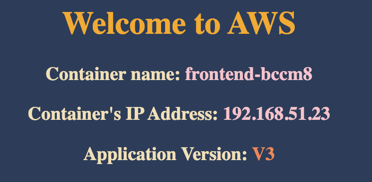

# ✅ Benefit:

- Maintain and running set of pods.
- If the pod is down, k8s can provision another pod. Maintain HA and resilency
  for application.
- Can `scale` replicaset up/down
- Group pod by using `labels`
- If you set `replicas=3`, and you have an existing pod with `matched label`.
  k8s only create two another pods.

# 1️⃣ Create replicaset's manifest

### 📗 Detail: https://kubernetes.io/docs/concepts/workloads/controllers/replicaset/

## ⭐️ Replicaset's manifest:

```
apiVersion: apps/v1
kind: ReplicaSet
metadata:
  name: frontend
  labels:
    app: user-mgnt
    tier: frontend
    env: dev
spec:
  # modify replicas according to your case
  replicas: 3
  selector:
    matchLabels:
      tier: frontend
  template:
    metadata:
      labels:
        tier: frontend
    spec:
      containers:
      - name: vietaws
        image: vietaws/eks:v3
```

Save the manifest to file: `rs-demo.yaml`

## ⭐️ Run the manifest

```
kubectl create -f rs-demo.yaml
```

➡️ Output: `replicaset.apps/frontend created`

# 2️⃣ Verify ReplicaSet

## ✅ Check replicaset status

```
kubectl get rs
```

Output:

```
NAME       DESIRED   CURRENT   READY   AGE
frontend   3         3         3       39s
```

➡️ There are 3 pods **READY**

## ✅ Check all pods

```
kubectl get pods
```

Output:

```
NAME             READY   STATUS    RESTARTS   AGE
frontend-56ctg   1/1     Running   0          112s
frontend-92chj   1/1     Running   0          112s
frontend-bccm8   1/1     Running   0          112s
```

## ✅ Check ReplicaSet detail

Syntax

```
kubectl describe rs <replicaset_name>
```

Example:

```
kubectl describe rs frontend
```

Output example:

```
Name:         frontend
Namespace:    default
Selector:     tier=frontend
Labels:       app=user-mgnt
              env=dev
              tier=frontend
Annotations:  <none>
Replicas:     3 current / 3 desired
Pods Status:  3 Running / 0 Waiting / 0 Succeeded / 0 Failed
Pod Template:
  Labels:  tier=frontend
  Containers:
   vietaws:
    Image:        vietaws/eks:v3
    Port:         <none>
    Host Port:    <none>
    Environment:  <none>
    Mounts:       <none>
  Volumes:        <none>
Events:
  Type    Reason            Age    From                   Message
  ----    ------            ----   ----                   -------
  Normal  SuccessfulCreate  7m56s  replicaset-controller  Created pod: frontend-92chj
  Normal  SuccessfulCreate  7m56s  replicaset-controller  Created pod: frontend-56ctg
  Normal  SuccessfulCreate  7m56s  replicaset-controller  Created pod: frontend-bccm8
```

## ✅ Check Pod detail

```

kubectl describe pods frontend-56ctg

```

`frontend-56ctg` is Pod name

# 3️⃣ Expose ReplicaSet to NodePort

Syntax

```
kubectl expose rs <replicaset_name> --type=NodePort --port=<container_port> --name=<service_name>
```

Example:

```
kubectl expose rs frontend --type=NodePort --port=8080  --name=service3
```

➡️ Output: `service/service3 exposed`

## ✅ Get service port

```
kubectl get svc
```

Output example:

```
NAME         TYPE        CLUSTER-IP       EXTERNAL-IP   PORT(S)          AGE
kubernetes   ClusterIP   10.100.0.1       <none>        443/TCP          3d12h
service3     NodePort    10.100.241.230   <none>        8080:32438/TCP   75s
```

**Running Port: 32438**

## ✅ Get Node's Public IP

```
kubectl get nodes -owide
```

Output example:

```
NAME                                                STATUS   ROLES    AGE     VERSION               INTERNAL-IP      EXTERNAL-IP    OS-IMAGE         KERNEL-VERSION                  CONTAINER-RUNTIME
ip-192-168-12-246.ap-southeast-1.compute.internal   Ready    <none>   3d11h   v1.29.0-eks-5e0fdde   192.168.12.246   52.221.232.0   Amazon Linux 2   5.10.213-201.855.amzn2.x86_64   containerd://1.7.11
ip-192-168-35-199.ap-southeast-1.compute.internal   Ready    <none>   3d11h   v1.29.0-eks-5e0fdde   192.168.35.199   47.129.54.45   Amazon Linux 2   5.10.213-201.855.amzn2.x86_64   containerd://1.7.11
```

## ✅ Access service

Website: http://47.129.54.45:32438



# 4️⃣ Advanced Verify

## ✅ Check ownerReferences

```
kubectl get pods <pod_name> -o yaml
```

Example:

```
kubectl get pods frontend-bccm8 -o yaml
```

Output:

```
apiVersion: v1
kind: Pod
metadata:
  creationTimestamp: "2024-04-22T20:10:53Z"
  generateName: frontend-
  labels:
    tier: frontend
  name: frontend-56ctg
  namespace: default
  ownerReferences:
  - apiVersion: apps/v1
    blockOwnerDeletion: true
    controller: true
    kind: ReplicaSet
    name: frontend
    uid: 80a10b2d-d7b6-4ac3-ae2c-b5a2bea3210b
  resourceVersion: "758612"
  uid: 1d838f2d-05bf-48bb-ba2b-35eab99df693
spec:
  containers:
  - image: vietaws/eks:v3
    imagePullPolicy: IfNotPresent
    name: vietaws
    resources: {}
    terminationMessagePath: /dev/termination-log
    terminationMessagePolicy: File
    volumeMounts:
    - mountPath: /var/run/secrets/kubernetes.io/serviceaccount
      name: kube-api-access-r8ndm
      readOnly: true
  dnsPolicy: ClusterFirst
  enableServiceLinks: true
  nodeName: ip-192-168-12-246.ap-southeast-1.compute.internal
  preemptionPolicy: PreemptLowerPriority
  priority: 0
  restartPolicy: Always
  schedulerName: default-scheduler
  securityContext: {}
  serviceAccount: default
  serviceAccountName: default
  terminationGracePeriodSeconds: 30
  tolerations:
  - effect: NoExecute
    key: node.kubernetes.io/not-ready
    operator: Exists
    tolerationSeconds: 300
  - effect: NoExecute
    key: node.kubernetes.io/unreachable
    operator: Exists
    tolerationSeconds: 300
  volumes:
  - name: kube-api-access-r8ndm
    projected:
      defaultMode: 420
      sources:
      - serviceAccountToken:
          expirationSeconds: 3607
          path: token
      - configMap:
          items:
          - key: ca.crt
            path: ca.crt
          name: kube-root-ca.crt
      - downwardAPI:
          items:
          - fieldRef:
              apiVersion: v1
              fieldPath: metadata.namespace
            path: namespace
status:
  conditions:
  - lastProbeTime: null
    lastTransitionTime: "2024-04-22T20:10:55Z"
    status: "True"
    type: PodReadyToStartContainers
  - lastProbeTime: null
    lastTransitionTime: "2024-04-22T20:10:53Z"
    status: "True"
    type: Initialized
  - lastProbeTime: null
    lastTransitionTime: "2024-04-22T20:10:55Z"
    status: "True"
    type: Ready
  - lastProbeTime: null
    lastTransitionTime: "2024-04-22T20:10:55Z"
    status: "True"
    type: ContainersReady
  - lastProbeTime: null
    lastTransitionTime: "2024-04-22T20:10:53Z"
    status: "True"
    type: PodScheduled
  containerStatuses:
  - containerID: containerd://0f340d8247e914748e591bdb1f21737834b04ceffa7a2ed05eeba6c93ccae8c1
    image: docker.io/vietaws/eks:v3
    imageID: docker.io/vietaws/eks@sha256:0cc3c5985f4e1fdc80197bce5ca4ab34902d57d9202dc1bd64da6b63d0c5dbf6
    lastState: {}
    name: vietaws
    ready: true
    restartCount: 0
    started: true
    state:
      running:
        startedAt: "2024-04-22T20:10:54Z"
  hostIP: 192.168.12.246
  hostIPs:
  - ip: 192.168.12.246
  phase: Running
  podIP: 192.168.17.248
  podIPs:
  - ip: 192.168.17.248
  qosClass: BestEffort
  startTime: "2024-04-22T20:10:53Z"

 /eks  k get pod frontend-bccm8 -o yaml                                                      ok  eks-vietaws kube
apiVersion: v1
kind: Pod
metadata:
  creationTimestamp: "2024-04-22T20:10:53Z"
  generateName: frontend-
  labels:
    tier: frontend
  name: frontend-bccm8
  namespace: default
  ownerReferences:
  - apiVersion: apps/v1
    blockOwnerDeletion: true
    controller: true
    kind: ReplicaSet
    name: frontend
    uid: 80a10b2d-d7b6-4ac3-ae2c-b5a2bea3210b
  resourceVersion: "758634"
  uid: 8d0b913d-d78d-4b90-a76c-10b2d6f98bcf
spec:
  containers:
  - image: vietaws/eks:v3
    imagePullPolicy: IfNotPresent
    name: vietaws
    resources: {}
    terminationMessagePath: /dev/termination-log
    terminationMessagePolicy: File
    volumeMounts:
    - mountPath: /var/run/secrets/kubernetes.io/serviceaccount
      name: kube-api-access-sjhgx
      readOnly: true
  dnsPolicy: ClusterFirst
  enableServiceLinks: true
  nodeName: ip-192-168-35-199.ap-southeast-1.compute.internal
  preemptionPolicy: PreemptLowerPriority
  priority: 0
  restartPolicy: Always
  schedulerName: default-scheduler
  securityContext: {}
  serviceAccount: default
  serviceAccountName: default
  terminationGracePeriodSeconds: 30
  tolerations:
  - effect: NoExecute
    key: node.kubernetes.io/not-ready
    operator: Exists
    tolerationSeconds: 300
  - effect: NoExecute
    key: node.kubernetes.io/unreachable
    operator: Exists
    tolerationSeconds: 300
  volumes:
  - name: kube-api-access-sjhgx
    projected:
      defaultMode: 420
      sources:
      - serviceAccountToken:
          expirationSeconds: 3607
          path: token
      - configMap:
          items:
          - key: ca.crt
            path: ca.crt
          name: kube-root-ca.crt
      - downwardAPI:
          items:
          - fieldRef:
              apiVersion: v1
              fieldPath: metadata.namespace
            path: namespace
status:
  conditions:
  - lastProbeTime: null
    lastTransitionTime: "2024-04-22T20:11:01Z"
    status: "True"
    type: PodReadyToStartContainers
  - lastProbeTime: null
    lastTransitionTime: "2024-04-22T20:10:53Z"
    status: "True"
    type: Initialized
  - lastProbeTime: null
    lastTransitionTime: "2024-04-22T20:11:01Z"
    status: "True"
    type: Ready
  - lastProbeTime: null
    lastTransitionTime: "2024-04-22T20:11:01Z"
    status: "True"
    type: ContainersReady
  - lastProbeTime: null
    lastTransitionTime: "2024-04-22T20:10:53Z"
    status: "True"
    type: PodScheduled
  containerStatuses:
  - containerID: containerd://9ebfa830c3a9b6e440ed75fc7ee86a48cc5f49896b044ad1dd197f122cdf0815
    image: docker.io/vietaws/eks:v3
    imageID: docker.io/vietaws/eks@sha256:a6a524444e7b8dc3a9501ddd3e99c6d0a7c0536162ed58669df14a43fc413945
    lastState: {}
    name: vietaws
    ready: true
    restartCount: 0
    started: true
    state:
      running:
        startedAt: "2024-04-22T20:11:00Z"
  hostIP: 192.168.35.199
  hostIPs:
  - ip: 192.168.35.199
  phase: Running
  podIP: 192.168.51.23
  podIPs:
  - ip: 192.168.51.23
  qosClass: BestEffort
  startTime: "2024-04-22T20:10:53Z"

```
