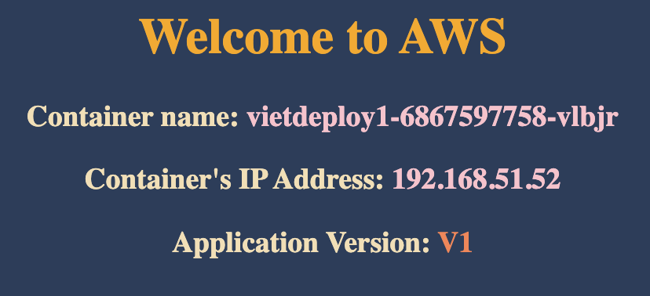

# 📗 Topics

1. Create Deployment
2. Scale Deployment
3. Expose Deployment as Service
4. Update Deployment
5. Rollback Deployment
6. Rolling Restarts
7. Pause & Resume Deployments
8. Canary Deployments

### 💡 Keynotes:

- Create a **Deployment** will roll-out a **ReplicaSet** automatically

# 1️⃣ Create Deployment

```
# Create Deployment
kubectl create deployment <deployment-name> --image=<container-image>
kubectl create deployment vietdeploy1 --image=vietaws/eks:v1
# Output: deployment.apps/vietdeploy1 created

# Verify Deployment
kubectl get deployments
kubectl get deploy

# Describe Deployment
kubectl describe deployment <deployment-name>
kubectl describe deployment vietdeploy1

# Verify ReplicaSet
kubectl get rs

# Verify Pod
kubectl get pods
```

# 2️⃣ Scale Deployment

```
# Scale Up the Deployment
kubectl scale --replicas=10 deployment/<deployment-name>
kubectl scale --replicas=10 deployment/vietdeploy1
# Output: deployment.apps/vietdeploy1 scaled

# Verify Deployment
kubectl get deploy

# Verify ReplicaSet
kubectl get rs

# Verify Pods
kubectl get pods

# Scale Down the Deployment
kubectl scale --replicas=5 deployment/vietdeploy1
kubectl get deploy

# Verify Pods
kubectl get pods
```

# 3️⃣ Expose Deployment as a Service

```
# Expose Deployment as a Service
kubectl expose deployment <deployment-name>  --type=NodePort --port=8080 --name=<service-name>
kubectl expose deployment vietdeploy1 --type=NodePort --port=8080 --name=service1
# Output: service/service1 exposed

# Get Service Info
kubectl get svc
Observation: Make a note of port which starts with 3 (Example: 80:3xxxx/TCP). Capture the port 3xxxx and use it in application URL below.

# Get Public IP of Worker Nodes
kubectl get nodes -owide
Observation: Make a note of "EXTERNAL-IP" if your Kubernetes cluster is setup on Amazon EKS.
```

**Pod Output:**

```
NAME                           READY   STATUS    RESTARTS   AGE
vietdeploy1-6867597758-767b8   1/1     Running   0          63s
vietdeploy1-6867597758-9rckw   1/1     Running   0          63s
vietdeploy1-6867597758-cmsz4   1/1     Running   0          2m9s
vietdeploy1-6867597758-w9dtt   1/1     Running   0          63s
vietdeploy1-6867597758-zr89h   1/1     Running   0          63s
```

Website:


