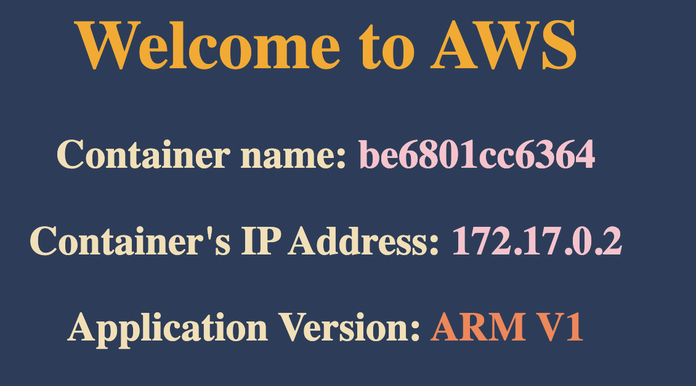

# 0️⃣ Docker installation

- https://docs.docker.com/install/

# 1️⃣ Verify docker

Command:

```
docker version
```

Output example:

```
Client:
 Cloud integration: v1.0.35+desktop.10
 Version:           25.0.3
 API version:       1.44
 Go version:        go1.21.6
 Git commit:        4debf41
 Built:             Tue Feb  6 21:13:26 2024
 OS/Arch:           darwin/arm64
 Context:           desktop-linux

Server: Docker Desktop 4.27.2 (137060)
 Engine:
  Version:          25.0.3
  API version:      1.44 (minimum version 1.24)
  Go version:       go1.21.6
  Git commit:       f417435
  Built:            Tue Feb  6 21:14:22 2024
  OS/Arch:          linux/arm64
  Experimental:     false
 containerd:
  Version:          1.6.28
  GitCommit:        ae07eda36dd25f8a1b98dfbf587313b99c0190bb
 runc:
  Version:          1.1.12
  GitCommit:        v1.1.12-0-g51d5e94
 docker-init:
  Version:          0.19.0
  GitCommit:        de40ad0
```

# 2️⃣ Docker Login

Command:

```
docker login
```

You have to create Docker account via: https://docker.com

After logging in with your created account. Here is an output:

```
Authenticating with existing credentials...
Login Succeeded
```

✅ It is not required to create docker account to start learning. But it is
recommdation for long term working on container pattern.

# 3️⃣ Running your first container

Command:

```
docker run -p <destination_port:source_port> <docker_image>

- destination_port: port will run on your computer
- source_port: listening port on your container (8080 in my containers)
- docker_image: your container docker on https://docker.com
```

Example:

```
docker run -p 8081:8080 vietaws/arm:v1
```

Output example:

```
> simple-app@1.0.0 start
> node index.js

Server is running on port 8080
```

‼️ Your container is running on port 8080, but you exposed to port 8081. Try to
access http://localhost:8081 and see the website.


